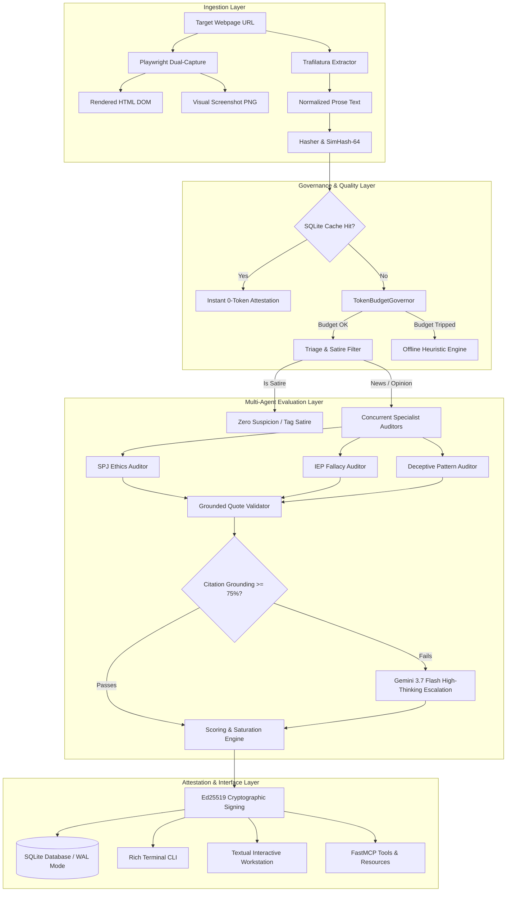

# Architecture of Credence

**Credence** is an autonomous epistemic evaluation engine, FastMCP server, and decentralized trust network designed to analyze digital media against formal journalistic ethics, logical fallacies, and deceptive UI patterns.

---

## 1. Dual-Capture Ingestion Engine

Credence captures both the structural content and visual presentation of any webpage:
- **Clean Prose Extraction** ([`credence/ingestion/extractor.py`](file:///home/pendragon/Projects/credence/credence/ingestion/extractor.py)): Uses Trafilatura to extract primary article text, title, author bylines, site names, and schema.org metadata while stripping ads and navigation boilerplate.
- **Visual & DOM Snapshotting** ([`credence/ingestion/snapshot.py`](file:///home/pendragon/Projects/credence/credence/ingestion/snapshot.py)): Runs headless Chromium via Playwright to generate full-page visual screenshots (`.png`) and rendered DOM dumps (`.html`).
- **Memory Protection Gate**: All Playwright browser instances are strictly serialized through an `asyncio.Semaphore(1)` gate (`MAX_CONCURRENT_SNAPSHOTS`), preventing OOM crashes in low-resource environments.
- **Deterministic Content Hashes** ([`credence/ingestion/hasher.py`](file:///home/pendragon/Projects/credence/credence/ingestion/hasher.py)):
  - Unicode NFKC normalization and whitespace collapsing.
  - Exact cryptographic `SHA-256` content hash.
  - 64-bit `SimHash` with Hamming distance comparison to identify mirror sites and near-duplicate publications.

---

## 2. Dynamic & Extensible Taxonomies

Taxonomies are completely decoupled from evaluation math:
- YAML catalogs reside in [`credence/taxonomies/`](file:///home/pendragon/Projects/credence/credence/taxonomies):
  1. **SPJ Journalism Ethics** (`spj_ethics.yaml`): Seek truth, minimize harm, act independently, be accountable.
  2. **IEP Logical Fallacies** (`iep_fallacies.yaml`): 6 cognitive clusters covering relevance, presumption, causality, emotion, ambiguity, and syllogisms.
  3. **Deceptive Patterns** (`deceptive_patterns.yaml`): UI/UX dark patterns including confirmshaming, fake countdown timers, disguised ads, and roach motels.
- Dynamic Discovery ([`credence/taxonomy_loader.py`](file:///home/pendragon/Projects/credence/credence/taxonomy_loader.py)):
  - Auto-discovers any arbitrary `.yaml` file added to the directory.
  - Generates namespaced rule URIs (e.g. `journalistic-ethics:seek-truth/SPJ-1.1@v1.0.0`).
  - Calculates deterministic canonical SHA-256 catalog hashes for cryptographic verification across decentralized mesh nodes.

---

## 3. Multi-Agent Pipeline & Grounded Citation Verification

Four specialized auditors scrutinize content in parallel:
1. **SPJ Ethics Auditor**: Verifies sourcing, anonymous bylines, and conflicts of interest.
2. **IEP Fallacy Auditor**: Dissects syllogistic breakdowns and manipulative rhetoric.
3. **Deceptive Pattern Auditor**: Identifies manipulative UI phrasing, forced actions, and disguised ads.
4. **Satire & Provenance Auditor**: Evaluates comedic hyperbole, absurd premises, and humor disclaimers to prevent Poe's Law false positives.

### Grounded Citation Verification
To eliminate LLM hallucinations, every violation finding must include an exact cited excerpt (`quote_or_element`). The **Grounded Quote Validator** ([`credence/pipeline/subagents.py`](file:///home/pendragon/Projects/credence/credence/pipeline/subagents.py)) tests the quote against the raw extracted prose using whitespace-insensitive substring and fuzzy token matching. Citations that fail grounding are stripped from scoring.

---

## 4. Mathematical Scoring & Satire Calibration Engine

Suspicion scores are computed using non-linear saturation curves:
- **Raw Suspicion**: $\text{raw\_score} = \sum_{v \in V} \text{severity}_v \times \text{confidence}_v \times \text{domain\_weight}_v$.
- **Suspicion Density**: $\text{density} = \frac{|V|}{\max(50, \text{word\_count})} \times 1000$ (violations per 1k words).
- **Calibrated Score ($0..100$)**: $\text{score} = 100 \times (1 - e^{-\text{raw\_score} / 12.0})$.
- **Poe's Law Satire Neutralization**: Legitimate satire (`is_satire=True`) zeroes the suspicion score to `0.0` and assigns `classification: SATIRE_PARODY`. Cloaked bad-faith disinformation (`SPJ-1.6`) bypasses neutralization.

---

## 5. Token Safety Governor & Quality Gate

The **TokenBudgetGovernor** ([`credence/pipeline/governor.py`](file:///home/pendragon/Projects/credence/credence/pipeline/governor.py)) guarantees autonomous audits never starve interactive Antigravity pairing sessions:
- Dedicated isolated API key priority (`CREDENCE_GEMINI_API_KEY`).
- In-database rolling token tracking (hourly limit, daily limit, USD spend cap) in SQLite (`TokenUsageRecord`).
- **Circuit Breaker**: Automatically trips into offline heuristic mode (`QUOTA_PRESERVED`) if limits are approached.
- **Thinking Token Accounting**: Tracks and bills reasoning tokens from **Gemini 3.7 Flash Thinking**.
- **Dynamic Quality Gate**: If grounded citation ratio drops below $75\%$, confidence is $<0.80$, or scores land on ambiguous boundaries ($12.0 - 18.0$), the governor dynamically elevates the thinking budget ($1,024 \to 4,096$ tokens) for tiebreaking.

---

## 6. Cryptographic Node Identity & Signed Attestations

Every audit is cryptographically verifiable:
- **Ed25519 Node Keypair** ([`credence/identity.py`](file:///home/pendragon/Projects/credence/credence/identity.py)): Persisted at `data/node_identity.key` with `0600` permissions.
- **RFC 8785 Canonical JSON Serialization**: Guarantees deterministic binary payloads for signature generation.
- **Tamper-Proof Verification**: Modifying any property (score, URL, quote, reasoning) immediately invalidates the signature.

---

## 7. Developer & Analyst Interfaces

- **Textual TUI Workstation** (`just tui` / `credence tui`): Full-screen interactive terminal workstation featuring live sidebar history, interactive violations data table, reader view, taxonomy browser, token quota monitors, and audit modal.
- **Rich CLI** (`credence audit`, `credence lookup`, `credence identity`, `credence quota`, `credence taxonomy`, `credence benchmark`): Formatted terminal summaries with colored gauges and tables.

---

## 8. Decentralized P2P Mesh & Robust Median Consensus

- **13-Node Heterogeneous Lattice** ($N = 13, d = 4$): Triangulates 3 Ultra anchors, 4 Balanced bridges, and 6 Free relays.
- **Byzantine Cartel Resilience** ($N \ge 3f + 1, f = 4$): Isolates coordinated 4-node malicious cartels ($30.8\%$ adversarial fraction).
- **Robust Median Centering**: Measures outlier deviations strictly from the median score ($|S_i - S_{\text{median}}| > 25.0$), completely preventing arithmetic mean-drag attacks.
- **The "Golden 12" Epistemic Benchmark Suite**: Automated 12-scenario evaluation matrix testing adversarial edge cases across all 3 cost profiles (`just benchmark`).
- **Host Resource Safety Governor**: Hardware pre-flight memory check auto-scales clusters to protect low-RAM systems (e.g. Raspberry Pis $<2\text{GB}$) alongside hard 128MB container cgroups limits.
