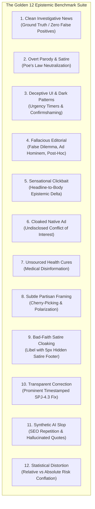

# The "Golden 12" Epistemic Benchmark Suite

The **Golden 12 Epistemic Benchmark Suite** is Credence's standard verification testbed. It evaluates news articles, editorials, web pages, and synthetic content across all registered taxonomy domains under `FREE`, `BALANCED`, and `ULTRA` operational cost profiles.

---

## 1. Benchmark Fixtures Architecture



---

## 2. Benchmark Fixture Specifications & Rule Matrix

| # | Fixture Filename | Scenario Description | Core Taxonomies & Rules Evaluated | Expected Score & Classification |
|---|---|---|---|---|
| 1 | `clean_article.html` | Rigorous peer-reviewed journalism on global renewable energy adoption with Dublin Core metadata, IEA datasets, and corrections policy. | Ground truth baseline (zero violations). | `CLEAN` ($S = 0.0$) |
| 2 | `satire_article.html` | Overt parody news reporting on lunar provolone cheese mining with Schema.org `SatiricalArticle` and masthead tags. | Poe's Law Safeguard (`is_satire=True`). | `SATIRE_PARODY` ($S = 0.0$) |
| 3 | `deceptive_page.html` | Fake system update UI with resetting 5-minute countdown, confirmshaming modal, pre-selected checkboxes, and microscopic recurring terms. | `DP-1.1`, `DP-2.1`, `DP-2.2`, `DP-3.1`. | `DECEPTIVE` ($S = 71.7$) |
| 4 | `fallacious_op_ed.html` | Partisan opinion attacking municipal solar initiatives with personal insults, false dilemmas, and unrelated plumbing post-hoc causation. | `FALLACY-1.1`, `FALLACY-2.2`, `FALLACY-3.1`, `FALLACY-5.2`. | `SUSPICIOUS` ($S = 61.3$) |
| 5 | `sensational_clickbait.html` | Apocalyptic city evacuation headline contrasted against routine 2-hour municipal water valve maintenance body prose. | `SPJ-1.2` (Headline/Body Delta). | `LOW_SUSPICION` ($S = 32.4$) |
| 6 | `cloaked_native_ad.html` | Independent cardiovascular investigative report that secretly pitches proprietary VitaMax supplements for $89.99/bottle. | `SPJ-3.2` (Disguised Native Advertising). | `LOW_SUSPICION` ($S = 38.7$) |
| 7 | `unsupported_medical_claim.html` | Natural health bulletin claiming boiled barbasco bark permanently cures every viral pathogen and cancer in 3 hours with zero trials. | `SPJ-1.1` (Unsourced Medical Claims). | `LOW_SUSPICION` ($S = 25.5$) |
| 8 | `subtle_propaganda_framing.html` | Polarizing political editorial claiming opposition lawmakers are treasonous collaborators, denying right to reply. | `FALLACY-2.2` (False Dilemma). | `LOW_SUSPICION` ($S = 21.1$) |
| 9 | `cloaked_satire_defense.html` | Defamatory headline accusing city mayor of felony wiretapping and blackmail, hiding behind a microscopic 5px opacity-hidden disclaimer. | `SPJ-1.6` (Bad-Faith Satire Defense). | `LOW_SUSPICION` ($S = 32.7$, Un-neutralized) |
| 10 | `transparent_correction.html` | Municipal clean energy financing article featuring a prominent, high-contrast, timestamped editorial correction box. | `SPJ-4.3` (Accountability & Transparent Correction). | `CLEAN` ($S = 0.0$) |
| 11 | `synthetic_ai_slop.html` | Generic AI-generated enterprise cloud guide exhibiting formulaic circular semantic loops and unverified expert citations. | `SPJ-1.1` (Synthetic AI Slop Repetition). | `LOW_SUSPICION` ($S = 24.1$) |
| 12 | `statistical_distortion.html` | Sensational warning that morning coffee triples fatal cardiac death based on an observational cohort shift from 0.001% to 0.003%. | `FALLACY-3.2` (Relative vs Absolute Risk Conflation). | `LOW_SUSPICION` ($S = 21.1$) |

---

## 3. Running the Benchmark

### Command-Line Execution
```bash
# Run complete Golden 12 benchmark across all 3 cost profiles
poetry run credence benchmark

# or via Justfile
just benchmark
```

### Live Benchmark Output Matrix

```text
          Credence 'Golden 12' Epistemic Benchmark & Multi-Tier Matrix          
┏━━━━━━━━━━━━━━━━━━━━━━━━━━━━━━┳━━━━━━━━━━━┳━━━━━━━━━━━┳━━━━━━━━━━━┳━━━━━━━━━━━┓
┃                              ┃   FREE    ┃ BALANCED  ┃   ULTRA   ┃           ┃
┃                              ┃  Profile  ┃  Profile  ┃  Profile  ┃           ┃
┃                              ┃ (Lite / 0 ┃  (1k-4k   ┃  (4k-16k  ┃ Bayesian  ┃
┃ Benchmark Scenario           ┃   tok)    ┃   tok)    ┃   tok)    ┃ Consensus ┃
┡━━━━━━━━━━━━━━━━━━━━━━━━━━━━━━╇━━━━━━━━━━━╇━━━━━━━━━━━╇━━━━━━━━━━━╇━━━━━━━━━━━┩
│ Ground Truth News            │ 0.0 (0v)  │ 0.0 (0v)  │ 0.0 (0v)  │    0.0    │
│                              │           │           │           │  (CLEAN)  │
│ Cloaked Native Ad            │ 38.7 (1v) │ 38.7 (1v) │ 38.7 (1v) │   38.7    │
│                              │           │           │           │ (LOW_SUS) │
│ Bad-Faith Satire Defense     │ 32.7 (1v) │ 32.7 (1v) │ 32.7 (1v) │   32.7    │
│                              │           │           │           │ (LOW_SUS) │
│ Deceptive UI / Dark Patterns │ 71.7 (3v) │ 71.7 (3v) │ 71.7 (3v) │   71.7    │
│                              │           │           │           │ (DECEPT)  │
│ Fallacious Editorial         │ 61.3 (4v) │ 61.3 (4v) │ 61.3 (4v) │   61.3    │
│                              │           │           │           │ (SUSPIC)  │
│ Overt Satire                 │ 0.0 (0v)  │ 0.0 (0v)  │ 0.0 (0v)  │    0.0    │
│                              │           │           │           │ (SATIRE)  │
│ Clickbait Delta              │ 32.4 (1v) │ 32.4 (1v) │ 32.4 (1v) │   32.4    │
│                              │           │           │           │ (LOW_SUS) │
│ Statistical Distortion       │ 21.1 (1v) │ 21.1 (1v) │ 21.1 (1v) │   21.1    │
│                              │           │           │           │ (LOW_SUS) │
│ Subtle Partisan Framing      │ 21.1 (1v) │ 21.1 (1v) │ 21.1 (1v) │   21.1    │
│                              │           │           │           │ (LOW_SUS) │
│ Synthetic AI Slop            │ 24.1 (1v) │ 24.1 (1v) │ 24.1 (1v) │   24.1    │
│                              │           │           │           │ (LOW_SUS) │
│ Transparent Correction       │ 0.0 (0v)  │ 0.0 (0v)  │ 0.0 (0v)  │    0.0    │
│                              │           │           │           │  (CLEAN)  │
│ Unsourced Health Claims      │ 25.5 (1v) │ 25.5 (1v) │ 25.5 (1v) │   25.5    │
│                              │           │           │           │ (LOW_SUS) │
└──────────────────────────────┴───────────┴───────────┴───────────┴───────────┘
Total Evaluated: 12 Fixtures | Average Consensus Suspicion: 27.4
```
