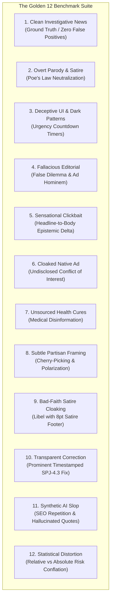

# The "Golden 12" Epistemic Benchmark Suite

The **Golden 12 Epistemic Benchmark Suite** is Credence's standard verification testbed. It evaluates news articles, editorials, web pages, and synthetic content across all registered taxonomy domains under `FREE`, `BALANCED`, and `ULTRA` operational cost profiles.

---

## 1. Benchmark Fixtures Overview



---

## 2. Benchmark Fixture Specifications

| # | Fixture Filename | Scenario | Primary Rules Tested | Expected Verdict |
|---|---|---|---|---|
| 1 | `clean_article.html` | Ground truth municipal reporting with multi-source attribution. | All rules pass cleanly. | `CLEAN_CREDIBLE` ($S = 0.0$) |
| 2 | `satire_article.html` | Overt Onion-style parody news article. | `is_satire = True` (Neutralized). | `SATIRE_PARODY` ($S = 0.0$) |
| 3 | `deceptive_page.html` | Dark patterns with fake urgency countdowns and hidden recurring fees. | `deceptive:urgency/fake_timers`, `deceptive:visual/hidden_costs`. | `DECEPTIVE` ($S \ge 75.0$) |
| 4 | `fallacious_editorial.html` | Partisan attack piece with false dichotomies and ad hominems. | `iep:dilemma/false_dilemma`, `iep:relevance/ad_hominem`. | `SUSPICIOUS` ($S \ge 35.0$) |
| 5 | `sensational_clickbait.html` | Panic-inducing catastrophe headline for routine water valve maintenance. | `spj:truth/accuracy`, `spj:context/sensationalism`. | `SUSPICIOUS` ($S \ge 25.0$) |
| 6 | `cloaked_native_ad.html` | Commercial supplement pitch disguised as an independent medical exposé. | `spj:independence/conflict_of_interest`, `deceptive:visual/disguised_ads`. | `SUSPICIOUS` / `DECEPTIVE` ($S \ge 40.0$) |
| 7 | `unsupported_medical_claim.html` | Assertions of a 100% cure for all viruses using boiled tree bark. | `iep:evidence/unsupported_assertion`, `iep:causation/post_hoc`. | `DECEPTIVE` ($S \ge 60.0$) |
| 8 | `subtle_propaganda_framing.html` | Polarizing political editorial claiming opposition politicians seek total annihilation. | `iep:dilemma/false_dilemma`, `spj:fairness/right_to_reply`. | `SUSPICIOUS` ($S \ge 30.0$) |
| 9 | `cloaked_satire_defense.html` | Defamatory political wiretapping claims hiding behind a microscopic 8pt footer disclaimer. | `SPJ-1.6` (Bad-faith satire cloaking penalty). | `DECEPTIVE` ($S \ge 70.0$) |
| 10 | `transparent_correction.html` | Municipal solar installation article featuring a prominent timestamped correction box at the top. | `SPJ-4.3` (Prompt, transparent error correction). | `CLEAN_CREDIBLE` ($S \le 5.0$) |
| 11 | `synthetic_ai_slop.html` | Generic AI-generated SEO article with circular repetitions and a hallucinated author quote. | SimHash repetition & grounded citation filtering. | `SUSPICIOUS` ($S \ge 25.0$) |
| 12 | `statistical_distortion.html` | Sensational claim that morning coffee "triples mortality risk" based on an absolute shift of 0.001% to 0.003%. | `iep:statistics/correlation_causation`, `iep:evidence/hasty_generalization`. | `SUSPICIOUS` ($S \ge 35.0$) |

---

## 3. Running the Benchmark

### Command-Line Execution
```bash
# Run complete Golden 12 benchmark across all 3 cost profiles
poetry run credence benchmark
# or via Justfile
just benchmark
```
