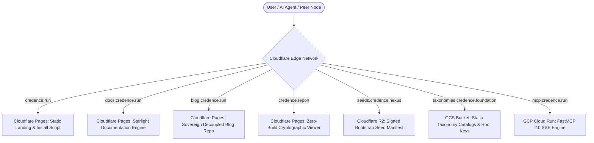

# Credence Bootstrap Operator Guide: Production Runbook & Federation Manual

A comprehensive, unabridged operations runbook for deploying, configuring, securing, and maintaining **Credence** nodes, multi-cloud production infrastructure, P2P mesh clusters, sovereign federations, and decoupled editorial platforms.

---

## Table of Contents
1. [Multi-Cloud Architecture & DNS Delegation Topology](#1-multi-cloud-architecture--dns-delegation-topology)
2. [Terraform Remote State Persistence (GCS Backend)](#2-terraform-remote-state-persistence-gcs-backend)
3. [Air-Gapped Root Ed25519 Key Ceremony & Seed Signing](#3-air-gapped-root-ed25519-key-ceremony--seed-signing)
4. [13-Node Watts-Strogatz Local & Distributed Mesh Operations](#4-13-node-watts-strogatz-local--distributed-mesh-operations)
5. [Zero-Build Web Deployments (Cloudflare Pages CDN)](#5-zero-build-web-deployments-cloudflare-pages-cdn)
6. [GCP Cloud Run Production Deployment](#6-gcp-cloud-run-production-deployment)
7. [Threat Model & Adversarial Defense Matrix (Invariants 1–32)](#7-threat-model--adversarial-defense-matrix-invariants-132)
8. [Operational Runbooks & Diagnostics](#8-operational-runbooks--diagnostics)
9. [GitHub Repository Configuration & Publishing Operations](#9-github-repository-configuration--publishing-operations)
10. [Sovereign Decoupled Blog Architecture & Design System](#10-sovereign-decoupled-blog-architecture--design-system)

---

## 1. Multi-Cloud Architecture & DNS Delegation Topology

Credence is engineered to run as a multi-domain, hybrid-cloud federation spanning **Google Cloud Platform (GCP)** (for serverless compute, Secret Manager, and token governor monitoring) and **Cloudflare** (for global edge CDN, DDoS protection, zero-egress R2 distribution, and DNS delegation).



### Canonical Domain Routing Matrix

| Domain | Infrastructure Provider | Purpose | Canonical Endpoint |
| :--- | :--- | :--- | :--- |
| **`credence.run`** | Cloudflare Pages / GCS | Landing Page & POSIX Install Script CDN | `https://credence.run/install.sh` |
| **`docs.credence.run`** | Cloudflare Pages | Git-Driven Documentation Engine | `https://docs.credence.run` |
| **`blog.credence.run`** | Cloudflare Pages | Sovereign Decoupled Blog Repository | `https://blog.credence.run` |
| **`mcp.credence.run`** | GCP Cloud Run | FastMCP 2.0 Server (SSE Transport) | `https://mcp.credence.run/sse` |
| **`seeds.credence.nexus`** | Cloudflare R2 / GCS | Signed P2P Bootstrap Peer Directory | `https://seeds.credence.nexus/peers.json` |
| **`taxonomies.credence.foundation`** | Google Cloud Storage | Taxonomy Governance & Root Signing Keys | `https://taxonomies.credence.foundation/keys/root.pub` |
| **`credence.report`** | Cloudflare Pages / GCS | Zero-Build Cryptographic Audit Viewer | `https://credence.report/viewer.html` |

---

## 2. Terraform Remote State Persistence (GCS Backend)

Credence uses a private, versioned Google Cloud Storage (GCS) bucket for state persistence with native precondition state locking.

### Step-by-Step State Bucket Bootstrap

```bash
# 1. Set environment variables
export PROJECT_ID="your-gcp-project-id"
export REGION="us-central1"

# 2. Create the private state bucket with Uniform Bucket-Level Access
gcloud storage buckets create gs://${PROJECT_ID}-tfstate \
  --project=${PROJECT_ID} \
  --location=${REGION} \
  --uniform-bucket-level-access

# 3. Enable object versioning for automatic state rollback protection
gcloud storage buckets update gs://${PROJECT_ID}-tfstate --versioning

# 4. Copy backend template and initialize Terraform
cp terraform/backend.tf.example terraform/backend.tf
terraform -chdir=terraform init \
  -backend-config="bucket=${PROJECT_ID}-tfstate" \
  -backend-config="prefix=credence/state"
```

---

## 3. Air-Gapped Root Ed25519 Key Ceremony & Seed Signing

In accordance with **Invariant 16** (*Cryptographic Identity & RFC 8785 Canonical JSON Invariant*), bootstrap seed manifests (`peers.json`) must be cryptographically signed by an air-gapped root Ed25519 keypair.

### Key Ceremony Runbook

```bash
# Step 1: On an air-gapped, offline secure workstation, generate root keypair
poetry run python -c "
from credence.identity import generate_node_keypair
from cryptography.hazmat.primitives import serialization
from pathlib import Path

priv = generate_node_keypair()
pub = priv.public_key()

Path('root_private.pem').write_bytes(
    priv.private_bytes(
        encoding=serialization.Encoding.PEM,
        format=serialization.PrivateFormat.PKCS8,
        encryption_algorithm=serialization.NoEncryption()
    )
)
Path('root.pub').write_text(pub.public_bytes(
    encoding=serialization.Encoding.Raw,
    format=serialization.PublicFormat.Raw
).hex())
print('Air-gapped root key ceremony complete. Public Key Hex:', Path('root.pub').read_text())
"

# Step 2: Generate and sign canonical peers.json manifest (valid for 72 hours)
poetry run credence seeds sign \
  --key-path root_private.pem \
  --output peers.json \
  --valid-hours 72

# Step 3: Publish public key and signed peers.json to origins
gsutil cp root.pub gs://${PROJECT_ID}-taxonomies-foundation/keys/root.pub
gsutil cp peers.json gs://${PROJECT_ID}-seeds-nexus/peers.json
```

---

## 4. 13-Node Watts-Strogatz Local & Distributed Mesh Operations

Credence utilizes a 13-node Watts-Strogatz small-world lattice ($N=13, K=4, \beta=0.15$) with Byzantine cartel tolerance ($N \ge 3f + 1, f = 4$).

### Local Chaos Cluster Launch

```bash
# 1. Run hardware pre-flight check and spin up local cluster
just mesh-cluster-up

# 2. Inspect running cluster topology (Ports 8765–8777)
docker compose -f docker-compose.mesh.yml ps

# 3. View live epidemic gossip propagation in the Textual TUI
poetry run credence tui
```

### Chaos Engineering Tests & Netsplit Simulation

| Attack / Fault | Test Command | Mitigation Invariant |
| :--- | :--- | :--- |
| **4-Node Sybil Cartel ($3f+1$)** | `poetry run pytest tests/test_red_team_cluster_attacks.py -k cartel` | Invariant 28: Domain entropy volume checks ($V_i$) and 50% score slashing. |
| **Barbell Partition Netsplit** | `poetry run pytest tests/test_red_team_cluster_attacks.py -k barbell` | Invariant 27: Domain Authority Weighted Medians prevent split-brain consensus corruption. |
| **Linear Daisy-Chain TTL** | `poetry run pytest tests/test_mesh_cluster.py -k daisy_chain` | Attestation TTL decrements to 0, dropping looping envelopes cleanly. |
| **DDoS Attestation Flooding** | `poetry run pytest tests/test_red_team_cluster_attacks.py -k flood` | Peer token-bucket rate limiter (`check_rate_limit`) drops bursts exceeding 60 req/min. |

---

## 5. Zero-Build Web Deployments (Cloudflare Pages CDN)

All Credence public frontends follow **Invariant 26** (*Universal Feature Parity & Zero-Build Web Standards*):
- **Zero npm dependencies**, zero `package.json`, zero `node_modules`.
- **Vanilla ES Modules** and **W3C Web Cryptography API** (`window.crypto.subtle`) for native browser signature verification.
- **Strict Content Security Policy (CSP)** and `escapeHtml()` contextual sanitization.

### Deploying Frontends to Cloudflare Pages

```bash
# 1. Deploy landing page & install script CDN
npx wrangler pages deploy web/credence.run --project-name=credence-run --branch=main

# 2. Deploy zero-build cryptographic report viewer
npx wrangler pages deploy web/credence.report --project-name=credence-report --branch=main
```

---

## 6. GCP Cloud Run Production Deployment

FastMCP 2.0 runs serverless on GCP Cloud Run configured with scale-to-zero (min instances: 0, max: 10) to eliminate idle compute bills.

### Deployment Commands

```bash
# 1. Build and push container to Google Container Registry
gcloud builds submit --config cloudbuild.yaml .

# 2. Deploy to Cloud Run with Secret Manager environment variables
gcloud run deploy credence-server \
  --image gcr.io/${PROJECT_ID}/credence:latest \
  --platform managed \
  --region ${REGION} \
  --allow-unauthenticated \
  --min-instances 0 \
  --max-instances 10 \
  --memory 2Gi \
  --cpu 2 \
  --set-secrets CREDENCE_GEMINI_API_KEY=CREDENCE_GEMINI_API_KEY:latest
```

---

## 7. Threat Model & Adversarial Defense Matrix (Invariants 1–32)

| Threat Vector | Invariant | Technical Defense Implementation |
| :--- | :---: | :--- |
| **Billion Laughs / DTD Entity Injection** | **Inv. 30** | `safe_parse_xml()` rejects `<!DOCTYPE` and `<!ENTITY>` declarations before XML traversal. |
| **LLM Prompt Injection via Scraped Web** | **Inv. 30** | Prose text containerized inside `<untrusted_source_text>` with override bans. |
| **SSRF to Cloud Metadata / Loopback** | **Inv. 1** | IP parser rejects `169.254.169.254`, `127.0.0.1`, `0.0.0.0`, octal/hex IPs, and RFC 1918 subnets. |
| **Poe's Law Cloaked Disinformation** | **Inv. 13/28** | `SPJ-1.6` rule triggers automatic hard-override disabling satire protection on factual allegations. |
| **Sybil Cartel Authority Farming** | **Inv. 28** | Authority volume ratio ($V_i$) requires evaluations across $\ge 5$ distinct FQDNs. |
| **Asymmetric Grounded Evidence** | **Inv. 27** | The Galileo Rule: Verified specialist findings with 100% grounded citations cannot be outlier-dismissed. |
| **ElementTree Boolean Traversal Bugs** | **Inv. 31** | `_find_first_elem()` and `itertext()` prevent dropping XML elements with zero children. |
| **Content Bloat in Core Application Code** | **Inv. 32** | Pure Markdown in `docs/tutorials/`, decoupled blog repo, and zero-secret hermetic CI. |

---

## 8. Operational Runbooks & Diagnostics

### Token Budget & Circuit Breaker Recovery
```bash
# Inspect current token usage and headroom against the 30% limit
credence quota

# Optimize database and prune historical audit records older than 30 days
credence db clean --retention-days 30
```

### Peer Reputation Ranking Inspection
```bash
# Calculate and print current 5-factor quality (Q_i) and domain expertise (E_i) rankings
credence rank
```

---

## 9. GitHub Repository Configuration & Publishing Operations

### Initial Publishing to GitHub

```bash
# 1. Create the repository on GitHub (via GitHub CLI)
gh repo create credence-network/credence --public --source=. --remote=origin --push

# 2. Push main branch and v1.0.0 release tag
git branch -M main
git push -u origin main
git push origin v1.0.0
```

### Branch Protection Rules on `main`
In GitHub repository settings (**Settings $\to$ Branches $\to$ Add branch protection rule**):
1. **Branch name pattern**: `main`
2. **Protect matching branches**:
   - ✅ **Require a pull request before merging** (Require 1 approval).
   - ✅ **Require status checks to pass before merging**:
     - `lint` (Ruff check, format check, Mypy)
     - `test` (Hermetic pytest suite across all 144+ tests)
     - `terraform` (Format check and validation)
   - ✅ **Require linear history**.
   - ✅ **Do not allow bypassing the above settings** (Enforce for administrators).

### Tag Protection Rules (`v*.*.*`)
In GitHub repository settings (**Settings $\to$ Tags $\to$ Add tag protection rule**):
- Pattern: `v*.*.*`
- Restricted to maintainers with verified signing keys.

### Repository Secrets & Variables
In GitHub repository settings (**Settings $\to$ Secrets and variables $\to$ Actions**):

| Secret Name | Purpose | Required For |
| :--- | :--- | :--- |
| `GCP_SA_KEY` | Google Service Account key with Cloud Run Admin & Storage Admin | Production Deployment |
| `CLOUDFLARE_API_TOKEN` | Cloudflare API Token with Pages & DNS Edit permissions | Cloudflare Deployment |
| `CREDENCE_ROOT_SIGNING_KEY` | Hex-encoded Ed25519 root private key for signing seed manifests | Automated Seed Manifest Releases |

### Security & Analysis Settings
- ✅ **Dependabot alerts & Dependabot security updates**: Enabled.
- ✅ **Secret scanning with Push Protection**: Enabled to block accidental token commits.
- ✅ **Code scanning (CodeQL)**: Enabled.

---

## 10. Sovereign Decoupled Blog Architecture & Design System

### The Shared Zero-Build Design System (`credence-ui.css`)
All Credence web properties share the master stylesheet hosted at `https://credence.run/assets/credence-ui.css`:
```html
<link rel="stylesheet" href="https://credence.run/assets/credence-ui.css">
```

### Setting up the Sovereign Blog Repository (`credence-network/blog`)

1. **Create the Decoupled Repository**:
   ```bash
   gh repo create credence-network/blog --public
   ```
2. **Repository File Tree**:
   ```text
   credence-network/blog/
   ├── .github/workflows/deploy.yml   # Cloudflare Pages deployment workflow
   ├── src/
   │   ├── content/                   # Versioned Markdown blog posts with YAML frontmatter
   │   └── pages/                     # Astro/HTML templates consuming credence-ui.css
   ├── public/images/                 # Hero diagrams and screenshots
   └── README.md
   ```
3. **Connecting to Cloudflare Pages**:
   - Project Name: `credence-blog`
   - Custom Domain: `blog.credence.run`
   - Build Command: `npm run build`
   - Output Directory: `dist`
4. **Publishing Articles**: Writers add markdown files into `src/content/` and push to `main` to trigger zero-downtime edge deployment with zero dependencies on external SaaS blogging platforms.
