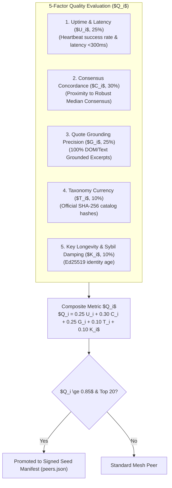
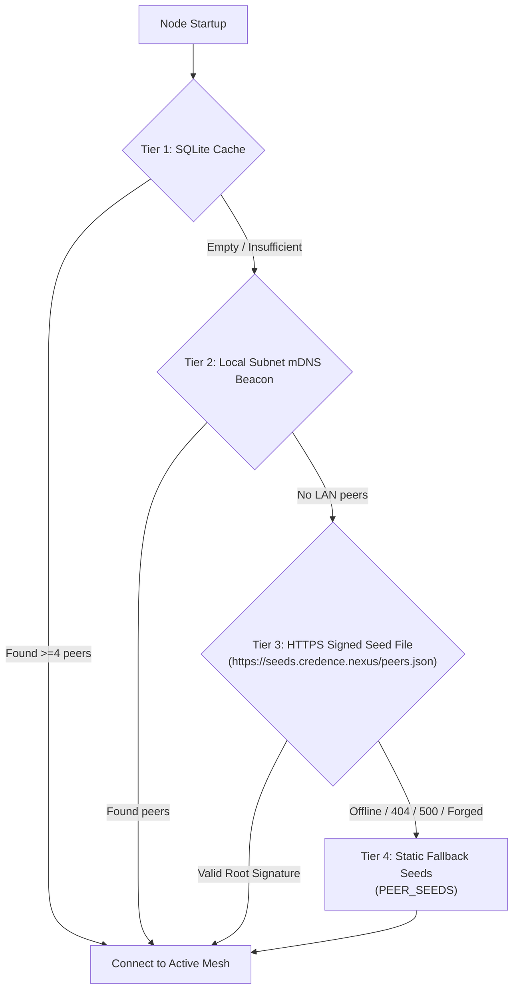

# P2P Bootstrap Seed Manifest & Epistemic Node Quality Protocol

Credence employs a decentralized, cryptographically verifiable **Bootstrap Seed Protocol** to allow new and recovering nodes to discover healthy peers without relying on centralized coordination servers.

---

## 1. Canonical Domain Infrastructure

The Credence network is anchored across 4 dedicated domains:

| Domain | Role & Purpose | Production Endpoints |
|---|---|---|
| **`credence.run`** | **Primary Canonical Website, MCP Service & CLI Hub** | `https://credence.run`<br/>`https://mcp.credence.run/sse`<br/>`curl -fsSL https://credence.run/install \| sh` |
| **`credence.nexus`** | **P2P Mesh Network & Bootstrap Seed Directory** | `https://seeds.credence.nexus/peers.json`<br/>`wss://relay.credence.nexus:8765`<br/>DNS SRV: `seed.credence.nexus` |
| **`credence.foundation`**| **Taxonomy Governance & Root Key Custody** | `https://taxonomies.credence.foundation/v1/...`<br/>`https://keys.credence.foundation/root.pub` |
| **`credence.report`** | **Public Audit Viewer & Shareable Permalinks** | `https://credence.report/a/{content_sha256}` |

---

## 2. 5-Factor Epistemic Node Quality Metric ($Q_i$)

Candidate seed nodes are ranked by a composite quality metric ($Q_i \in [0.0, 1.0]$) that evaluates both network stability and epistemic integrity:

$$Q_i = 0.25 U_i + 0.30 C_i + 0.25 G_i + 0.10 T_i + 0.10 K_i$$



### Factor Definitions:

1. **Uptime & Latency ($U_i \in [0, 1]$)**:
   $$U_i = \text{success\_ratio} \times \left(0.7 + 0.3 \times \max\left(0, 1 - \frac{\text{latency\_ms}}{1000}\right)\right)$$
2. **Robust Consensus Concordance ($C_i \in [0, 1]$)**:
   $$C_i = \max\left(0.0, 1.0 - \frac{\text{avg\_median\_deviation}}{50.0}\right)$$
   *Measures alignment with the Robust Median score. Byzantine Sybil cartels attempting to skew consensus are flagged as outliers and penalized.*
3. **Quote Grounding Precision ($G_i \in [0, 1]$)**:
   $$G_i = \frac{\text{grounded\_citations}}{\text{total\_citations}}$$
   *Collapses to 0.0 if a node hallucinates or submits fictitious citations.*
4. **Taxonomy Catalog Currency ($T_i \in \{0, 1\}$)**:
   $$T_i = 1.0 \iff \text{hashes}_i == \text{official\_catalog\_hashes}$$
5. **Key Longevity & Sybil Damping ($K_i \in [0, 1]$)**:
   $$K_i = \min\left(1.0, \frac{\ln(1 + \text{days\_active})}{\ln(1 + 90)}\right)$$
   *Dampens freshly generated "burner" keys.*

---

## 3. 4-Tier Discovery Fallback Sequence



---

## 4. CLI Usage

```bash
# 1. Inspect live node quality leaderboard
poetry run credence mesh rank

# 2. Fetch and cryptographically verify active seed nodes
poetry run credence mesh seeds fetch --url https://seeds.credence.nexus/peers.json

# 3. Generate and sign a new seed manifest from top-ranked local peers
poetry run credence mesh seeds generate --output seeds.json --valid-hours 24

# 4. Verify an on-disk seed manifest
poetry run credence mesh seeds verify seeds.json
```
