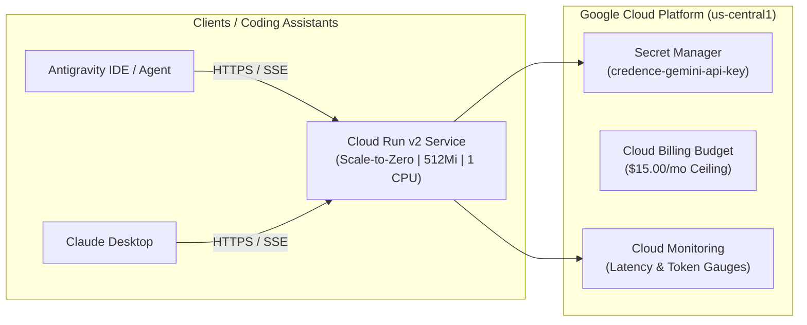

# Cloud Run Deployment & Terraform Infrastructure Guide

This guide covers deploying the **Credence FastMCP Server** to **Google Cloud Platform (Cloud Run v2)** with strict cost controls ($15/month budget ceiling, scale-to-zero) and automated **Cloud Build CI/CD**.

---

## 1. Architecture Overview



---

## 2. Prerequisites

1. Google Cloud SDK (`gcloud`) installed and authenticated.
2. Terraform $\ge 1.5.0$.
3. A Google Cloud project with Billing enabled.

---

## 3. Deployment Steps via Terraform

### Step 1: Initialize gcloud & Enable APIs
```bash
gcloud config set project YOUR_PROJECT_ID

gcloud services enable \
    run.googleapis.com \
    secretmanager.googleapis.com \
    artifactregistry.googleapis.com \
    cloudbuild.googleapis.com \
    billingbudgets.googleapis.com \
    monitoring.googleapis.com
```

### Step 2: Configure Terraform Variables
Create `terraform/terraform.tfvars`:
```hcl
project_id                  = "YOUR_PROJECT_ID"
region                      = "us-central1"
service_name                = "credence-server"
credence_profile            = "balanced" # or 'free', 'ultra'
monthly_budget_limit_usd    = 15.00
billing_account_id          = "YOUR_BILLING_ACCOUNT_ID"
alert_email_addresses       = ["admin@yourdomain.com"]
```

### Step 3: Initialize and Apply Terraform
```bash
cd terraform
terraform init
terraform plan
terraform apply
```

### Step 4: Add Gemini API Key to Secret Manager
```bash
echo -n "YOUR_GEMINI_API_KEY" | gcloud secrets versions add credence-gemini-api-key --data-file=-
```

---

## 4. Connecting Antigravity & Claude Desktop to Cloud Run

Once deployed, retrieve your Cloud Run SSE endpoint from Terraform outputs:
```bash
terraform output sse_endpoint
# Output: https://credence-server-xxxxx-uc.a.run.app/sse
```

Add the remote endpoint to your `mcp_config.json`:
```json
{
  "mcpServers": {
    "credence_remote": {
      "url": "https://credence-server-xxxxx-uc.a.run.app/sse"
    }
  }
}
```

---

## 5. Automated CI/CD via Cloud Build (`cloudbuild.yaml`)

Trigger automated testing, image builds, and zero-downtime deployment on git push:

```bash
gcloud builds submit --config=cloudbuild.yaml .
```
