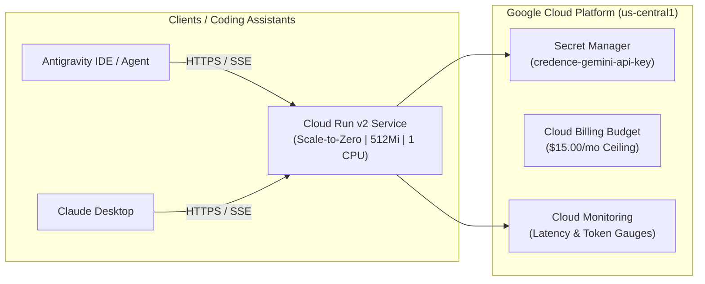

# Cloud Run Deployment & Terraform Infrastructure Guide

This guide covers deploying the **Credence FastMCP Server** to **Google Cloud Platform (Cloud Run v2)** with strict cost controls ($15/month budget ceiling, scale-to-zero) and automated **Cloud Build CI/CD**.

---

## 1. Architecture Overview



---

## 2. Prerequisites

1. Google Cloud SDK (`gcloud`) installed and authenticated.
2. Terraform $\ge 1.5.0$.
3. A Google Cloud project with Billing enabled.

---

## 3. Deployment Steps via Terraform

### Step 1: Initialize gcloud & Enable APIs
```bash
gcloud config set project YOUR_PROJECT_ID

gcloud services enable \
    run.googleapis.com \
    secretmanager.googleapis.com \
    artifactregistry.googleapis.com \
    cloudbuild.googleapis.com \
    billingbudgets.googleapis.com \
    monitoring.googleapis.com
```

### Step 2: Configure Terraform Variables
Create `terraform/terraform.tfvars`:
```hcl
project_id                  = "YOUR_PROJECT_ID"
region                      = "us-central1"
service_name                = "credence-server"
credence_profile            = "balanced" # or 'free', 'ultra'
monthly_budget_limit_usd    = 15.00
billing_account_id          = "YOUR_BILLING_ACCOUNT_ID"
alert_email_addresses       = ["admin@yourdomain.com"]
```

### Step 3: Initialize and Apply Terraform
```bash
cd terraform
terraform init
terraform plan
terraform apply
```

### Step 4: Add Gemini API Key to Secret Manager
```bash
echo -n "YOUR_GEMINI_API_KEY" | gcloud secrets versions add credence-gemini-api-key --data-file=-
```

---

## 4. Connecting Antigravity & Claude Desktop to Cloud Run

Once deployed, retrieve your Cloud Run SSE endpoint from Terraform outputs:
```bash
terraform output sse_endpoint
# Output: https://credence-server-xxxxx-uc.a.run.app/sse
```

Add the remote endpoint to your `mcp_config.json`:
```json
{
  "mcpServers": {
    "credence_remote": {
      "url": "https://credence-server-xxxxx-uc.a.run.app/sse"
    }
  }
}
```

---

## 5. Parameterized Operator Workflows (`Justfile`)

The repository provides a single canonical parameterized operator command family (`just gcp [action] [arg]`) with automated preflight validation:

| Command | Action | Description |
| :--- | :--- | :--- |
| `just preflight gcloud` | Preflight Gate | Verifies `gcloud` binary installation and active authenticated account. |
| `just gcp status` | Inspection | Displays active Cloud Run revision, image tag, CPU/memory, and traffic split. |
| `just gcp logs [limit]` | Forensics | Queries structured Cloud Run logs via `gcloud logging read` (default: 30 lines). |
| `just gcp tail` | Live Stream | Streams real-time container logs via `gcloud beta run services logs tail`. |
| `just gcp revisions` | History | Lists all historical revisions with author, deploy timestamp, and traffic split. |
| `just gcp describe` | Deep Inspect | Dumps full JSON/YAML service specification. |
| `just gcp probe` | Multi-Probe | Probes `/health`, `/api/health`, `/sse`, `/api/reports`, and `/api/sifter/status`. |
| `just gcp germinate [burst]` | Remote Sifting | Invokes remote `/api/germinate` endpoint to trigger Miracle-Gro ignition. |
| `just gcp rollback <revision>` | Safe Revert | Rolls back 100% traffic allocation to a previous healthy revision. |
| `just deploy backend` | Safe Deploy | Submits container build via Cloud Build, deploys to Cloud Run, and executes health probe. |

---

## 6. GitHub Actions Automated Deployment (`.github/workflows/deploy-backend.yml`)

Cloud Run deployments can be automated on release tags (`v*.*.*`) or via manual trigger (`workflow_dispatch`).

### Step 1: Configure Workload Identity Federation (Recommended)
```bash
# 1. Create Workload Identity Pool
gcloud iam workload-identity-pools create "github-pool" \
    --project="YOUR_PROJECT_ID" \
    --location="global" \
    --display-name="GitHub Actions Pool"

# 2. Create Workload Identity Provider for GitHub Repository
gcloud iam workload-identity-pools providers create-oidc "github-provider" \
    --project="YOUR_PROJECT_ID" \
    --location="global" \
    --workload-identity-pool="github-pool" \
    --display-name="GitHub Provider" \
    --attribute-mapping="google.subject=assertion.sub,attribute.actor=assertion.actor,attribute.repository=assertion.repository" \
    --issuer-uri="https://token.actions.githubusercontent.com"

# 3. Grant Service Account Access
gcloud iam service-accounts add-iam-policy-binding "credence-cloud-run-sa@YOUR_PROJECT_ID.iam.gserviceaccount.com" \
    --project="YOUR_PROJECT_ID" \
    --role="roles/iam.workloadIdentityUser" \
    --member="principalSet://iam.googleapis.com/projects/PROJECT_NUMBER/locations/global/workloadIdentityPools/github-pool/attribute.repository/artibyrd/credence"
```

### Step 2: Configure GitHub Repository Secrets
Add the following secrets to `artibyrd/credence` via `gh secret set`:
- `GCP_WORKLOAD_IDENTITY_PROVIDER`: `projects/PROJECT_NUMBER/locations/global/workloadIdentityPools/github-pool/providers/github-provider`
- `GCP_SERVICE_ACCOUNT`: `credence-cloud-run-sa@YOUR_PROJECT_ID.iam.gserviceaccount.com`

When secrets are omitted, the workflow cleanly skips automated deployment and provides instructions for operator deployment via `just deploy backend`.

