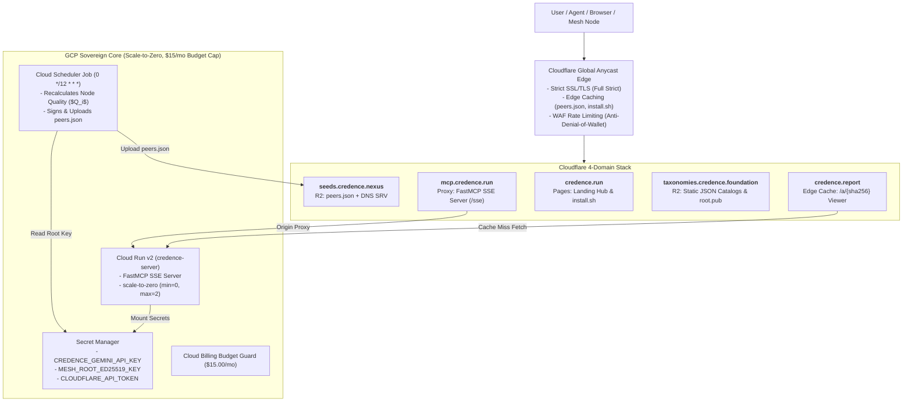

# Multi-Cloud Deployment Guide: GCP Cloud Run & Cloudflare

This runbook details how to deploy and operate the Credence hybrid multi-cloud infrastructure across **Google Cloud Platform (GCP)** and **Cloudflare**.

---

## 1. Architecture Overview



---

## 2. Prerequisites

1. **Google Cloud SDK (`gcloud`)** installed and authenticated:
   ```bash
   gcloud auth login
   gcloud auth application-default login
   ```
2. **Terraform (`>= 1.5.0`)** installed:
   ```bash
   terraform version
   ```
3. **Cloudflare Account & Scoped API Token**:
   - Create a token with `Zone:DNS:Edit`, `Zone:Zone:Read`, `Account:R2:Edit`, `Zone:Cache Rules:Edit`, `Zone:WAF:Edit`.
4. **Namecheap (or Registrar) DNS Delegation**:
   - Switch nameservers for your 4 domains to point to your assigned Cloudflare nameservers.

---

## 3. Deployment Steps

### Step 1: Prepare Terraform Variables
Create a local `terraform/terraform.tfvars` file (ignored by Git):

```hcl
project_id               = "your-gcp-project-id"
region                   = "us-central1"
service_name             = "credence-server"
credence_profile         = "balanced"
monthly_budget_limit_usd = 15.00
billing_account_id       = "012345-567890-ABCDEF"
alert_email_addresses    = ["admin@yourdomain.com"]

# Cloudflare Configuration
cloudflare_api_token     = "YOUR_CLOUDFLARE_API_TOKEN"
cloudflare_account_id    = "YOUR_CLOUDFLARE_ACCOUNT_ID"

# Domain Mappings
domain_credence_run        = "credence.run"
domain_credence_nexus      = "credence.nexus"
domain_credence_foundation = "credence.foundation"
domain_credence_report     = "credence.report"
```

### Step 2: Dry-Run Inspection ("Mk1 Eyeball")
Validate and plan the infrastructure without applying:

```bash
cd terraform
terraform init
terraform plan -out=tfplan
```

### Step 3: Apply Infrastructure
```bash
terraform apply tfplan
```

### Step 4: Sync Static Frontends & Bootstrap Seeds
```bash
# 1. Publish official static taxonomies & root public key
poetry run python scripts/publish_taxonomies.py --live

# 2. Rank nodes, generate signed seed manifest, and upload
poetry run python scripts/publish_seeds.py --live
```

---

## 4. Live Verification & Testing

Execute the segregated live end-to-end integration test suite against your live domains:

```bash
export CREDENCE_LIVE_TESTS=1
just test-e2e
```
