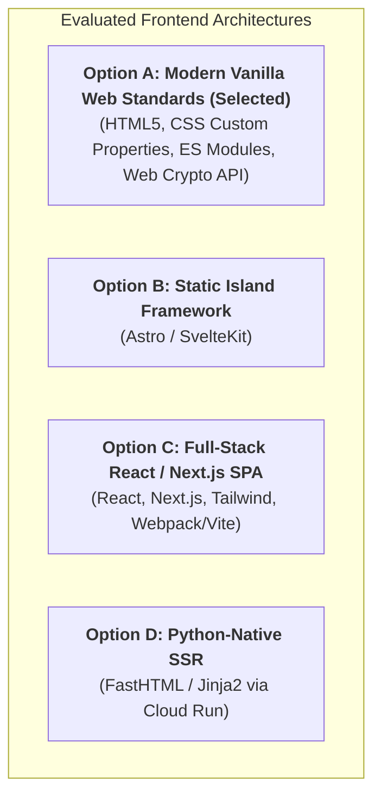
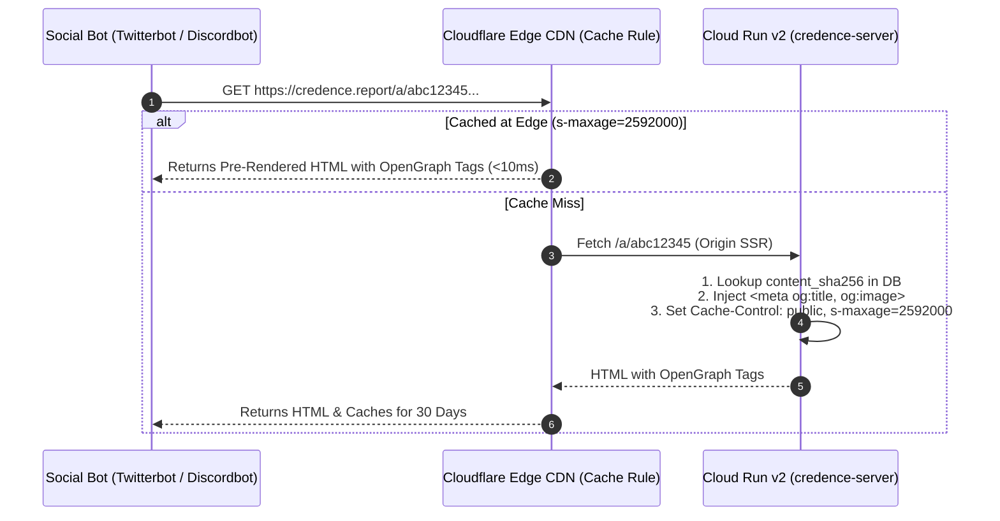

# Web Frontend Architecture & Zero-Build Decision Record

This document records the architectural decisions, trade-off evaluations, and strict invariants governing the public web surfaces across the **Credence** ecosystem:
1. **`credence.run`** (Primary Canonical Website, FastMCP Service & CLI Hub)
2. **`credence.nexus`** (P2P Mesh Network & Bootstrap Seed Directory)
3. **`credence.foundation`** (Taxonomy Governance & Root Key Custody)
4. **`credence.report`** (Public Audit Viewer & Shareable Permalinks)

---

## 1. Architectural Invariant (Invariant 20)

> [!IMPORTANT]
> **Invariant 20: Web Frontend Zero-Build & Web Crypto Verification Invariant**
> - All public web frontends across the Credence ecosystem must be built strictly using **vanilla modern web standards** (Semantic HTML5, CSS Custom Properties, and native ES Modules) with **zero Node.js/npm build dependencies** and zero JavaScript runtime frameworks.
> - Client-side cryptographic verification of signed audit reports and seed files must strictly use the native W3C **Web Cryptography API** (`window.crypto.subtle`) rather than external JavaScript crypto libraries.
> - Dynamic social previews (OpenGraph / Twitter cards) must be pre-rendered or injected by edge cache rules / Cloud Run serverless endpoints with long-lived edge caching (`s-maxage=2592000`) rather than requiring client-side single-page app hydration.

---

## 2. Decision Rationale & Evaluated Alternatives

We evaluated 4 distinct architectural candidates before committing to this architecture:



### Comparative Evaluation Matrix:

| Evaluation Dimension | **Option A: Vanilla Web Standards** *(Selected)* | **Option B: Astro / Svelte** | **Option C: Next.js / React** | **Option D: Python SSR (FastHTML)** |
|---|---|---|---|---|
| **Build Toolchain** | **Zero Build Tools** (0 `node_modules`, 0 npm packages) | Node.js + npm build step | Heavy Node.js + npm build step | Python-only (No Node.js) |
| **PageSpeed / Lighthouse** | **100 / 100** (<30KB payload, <15ms TTFB) | **95–100** (<60KB payload) | **70–85** (Heavy JS hydration) | **95–100** (Server HTML) |
| **Supply Chain Security** | **Zero npm vulnerabilities** | Moderate npm dependency tree | High npm dependency tree (300+ packages) | Zero npm dependencies |
| **White-Label Customization** | **Trivially Simple**: Single HTML/CSS file edit or CLI token substitution. | Requires cloning repo and running `npm run build`. | Complex component hierarchy & build scripts. | Python template edits. |
| **In-Browser Ed25519 Verification** | **Native**: `window.crypto.subtle` (native in modern Chromium/Safari/Firefox). | Requires npm crypto wrapper or Web Crypto API. | Requires heavy `@noble/ed25519` package. | Verification on server or client JS. |
| **Edge Hosting Cost** | **$0.00** on Cloudflare Pages / R2 edge. | **$0.00** on Cloudflare Pages. | Requires Node server or static export. | Cloud Run compute cost per request. |

---

## 3. Deep-Dive Rationale

### A. Zero Supply Chain Attack Surface for an Epistemic Security Engine
Credence is designed to audit truthfulness, journalistic integrity, and adversarial manipulation. Introducing a standard JavaScript frontend stack (React, Next.js, Webpack, Babel) introduces a dependency graph of **300+ transitive npm packages**. This creates an ongoing supply-chain attack surface and maintenance burden (`npm audit`, dependency drift, deprecated bundlers). Vanilla HTML5/CSS/JS has **zero external supply-chain dependencies**.

### B. In-Browser Trustless Verification via `Web Cryptography API`
When an auditor or reader inspects a permalink at `https://credence.report/a/{content_sha256}`:
1. The browser retrieves the raw signed `AuditReport` JSON.
2. The browser executes native in-browser cryptographic verification via `window.crypto.subtle.verify(...)` using the author's public Ed25519 key.
3. The reader achieves **true trustless client-side verification** without trusting the web hosting server or loading third-party crypto scripts.

### C. Frictionless White-Labeling & Federation (`credence mesh init-org`)
Third-party organizations (newsrooms, university journalism departments, enterprise compliance teams) spinning up their own sovereign mesh federation must not be forced to install Node.js, npm, or complex build pipelines. 

With vanilla web standards, the Python CLI tool `credence mesh init-org` templates the organization's name, brand colors, contact info, and root public keys directly into static HTML/CSS files ready for immediate deployment to Cloudflare Pages or Cloud Storage.

### D. Global Edge CDN Delivery (100/100 Lighthouse & Zero Egress)
- Complete static assets for `credence.run` are under **25 KB** uncompressed (under **8 KB** with Brotli compression).
- Hosted on Cloudflare Pages / R2 with Anycast edge routing across 300+ cities globally.
- Delivers **< 15ms Time to First Byte (TTFB)** globally at **$0.00 bandwidth and compute cost**.

---

## 4. OpenGraph Social Card Preview Architecture

Social media platforms (Twitter/X, Discord, Slack, LinkedIn, Reddit) crawl links using headless bots that do not execute JavaScript. To ensure shared audit permalinks like `https://credence.report/a/{sha256}` unfurl rich social cards:



---

## 5. File Structure Convention (`web/`)

All static frontends reside in the `/web` root directory:

```
web/
├── credence.run/
│   ├── index.html            # Main Landing Hub (Quickstart, MCP Config, Benchmark Matrix)
│   ├── styles.css            # High-contrast, lightweight responsive CSS
│   └── install.sh            # Canonical one-line installer script
├── credence.nexus/
│   ├── index.html            # Mesh Explorer & Peer Map Visualization
│   └── styles.css
├── credence.foundation/
│   ├── index.html            # Taxonomy Governance & Key Directory
│   ├── keys/
│   │   └── root.pub          # Network Root Ed25519 Public Key
│   └── v1/
│       ├── journalistic-ethics.json
│       ├── logical-fallacy.json
│       └── deceptive-pattern.json
└── credence.report/
    ├── index.html            # Public Audit Search & Lookup Hub
    ├── viewer.html           # Standalone Attestation Viewer (DOM quotes, score meter, signature badge)
    └── styles.css            # High-contrast report styling
```
