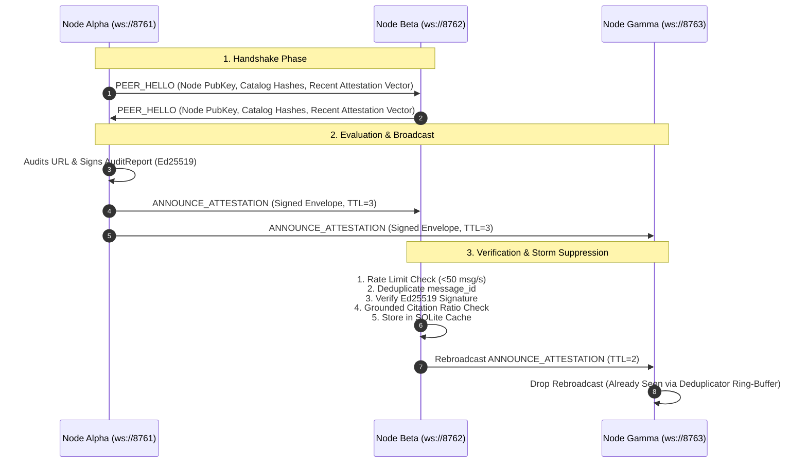

# Credence Mesh: P2P Gossip Protocol & Bayesian Consensus

The **Credence Mesh** ([`credence/mesh/`](file:///home/pendragon/Projects/credence/credence/mesh/)) is an asynchronous, decentralized peer-to-peer trust network that enables independent Credence nodes to exchange, verify, and aggregate Ed25519-signed audit attestations over WebSockets.

---

## 1. Why Decentralize Epistemic Auditing?

Centralized truth or fact-checking APIs have fundamental flaws:
1. **Single Points of Failure & Censorship**: Centralized nodes can be blocked, DDoS'd, or politically coerced.
2. **Duplicative Compute / Token Waste**: If Node A already spent tokens auditing a breaking news article, Node B should be able to verify Node A's cryptographic attestation and reuse the result in $0$ LLM tokens.
3. **Byzantine Fault Tolerance**: By gathering signed evaluations from multiple independent nodes and computing **Bayesian consensus**, the network eliminates rogue or compromised nodes.

---

## 2. P2P Gossip Protocol Specification



---

## 3. Envelope Data Structures (`protocol.py`)

Every message exchanged across the mesh is wrapped in a cryptographically signed envelope:

```python
class MeshMessageEnvelope(BaseModel):
    message_id: str = Field(default_factory=lambda: str(uuid.uuid4()))
    message_type: MeshMessageType  # PEER_HELLO, ANNOUNCE_ATTESTATION, REQUEST_ATTESTATION, etc.
    sender_pubkey: str            # Ed25519 Public Key Hex
    timestamp: datetime           # Transmission UTC Timestamp
    payload: Dict[str, Any]       # Typed Message Payload
    signature: Optional[str]      # Ed25519 signature over deterministic RFC 8785 JSON
```

---

## 4. Bayesian Consensus & Robust Median Outlier Detection (`consensus.py`)

When multiple independent mesh nodes audit the same content SHA-256, the `BayesianConsensusAggregator` calculates a confidence-weighted consensus score:

$$\bar{S}_{\text{consensus}} = \frac{\sum_{i=1}^N S_i \times W_i}{\sum_{i=1}^N W_i}$$

Where the effective peer attestation weight $W_i$ is computed as:
$$W_i = \max\left(0.01, C_i \times R_i \times \left(0.5 + 0.5 \times G_i\right)\right)$$

- $S_i$: Evaluator suspicion score ($0.0 \dots 100.0$).
- $C_i$: Evaluator confidence ($0.0 \dots 1.0$).
- $R_i$: Node peer reputation weight ($1.0$ default).
- $G_i$: Grounded citation ratio ($\frac{\text{Grounded Citations}}{\text{Total Citations}}$).

### Robust Median Baseline vs. Arithmetic Mean Drag
In standard outlier rejection, measuring deviation against the arithmetic weighted mean ($|S_i - \bar{S}_{\text{mean}}| > 25.0$) creates a severe vulnerability in bimodal distributions. When a coordinated Sybil cartel ($f = 4$) colludes with extreme whitewashing scores ($S \approx 0.0$), their votes drag the arithmetic mean downward, causing honest nodes detecting high deception ($S \ge 85.0$) to be erroneously flagged as outliers!

Credence prevents this attack by anchoring outlier detection to the **robust median score** $S_{\text{median}}$:
$$\text{Delta}_i = |S_i - S_{\text{median}}| > 25.0$$

Because the median is unaffected by extreme bimodal tails under honest quorum ($N \ge 3f + 1$), the baseline remains locked to the honest consensus, and all cartel nodes are cleanly stripped from the final weighted calculation.

---

## 5. 13-Node Heterogeneous Mesh Topology ($N = 13, d = 4 \dots 5$)

Credence benchmarks its decentralized network against a **13-node heterogeneous small-world lattice** (the mathematical point of diminishing returns):

- **3 `ULTRA` Anchor Hubs** (Nodes 1, 7, 13): NYT / Reuters / institutional fact-checking grade ($16\text{k}$ reasoning tokens).
- **4 `BALANCED` Bridges** (Nodes 3, 5, 9, 11): Standard developer and community bridges ($1\text{k}-4\text{k}$ tokens).
- **6 `FREE` Edge Relays** (Nodes 2, 4, 6, 8, 10, 12): Lightweight zero-token signature verification relays.

### Byzantine Cartel Collusion Isolation ($N \ge 3f + 1, f = 4$)
A 13-node mesh is mathematically resilient against a coordinated **4-node malicious Sybil cartel** ($30.8\%$ malicious fraction) attempting to whitelist deceptive disinformation.

---

## 6. Pathological Cluster Topology Stress Testing

Credence tests 4 edge-case "bad" cluster topologies in [`tests/test_mesh_cluster.py`](file:///home/pendragon/Projects/credence/tests/test_mesh_cluster.py):

1. **Linear Daisy Chain ($d = 12$)**: Tests message propagation across maximum diameter, TTL decrementing ($10 \to 0$), and link death.
2. **Barbell Chokepoint & Netsplit**: Tests two 6-node clusters separated by a single bridge link ($N_6 \leftrightarrow N_7$), simulating partition divergence and re-convergence on healing.
3. **Sybil Eclipse Attack**: Tests an honest victim node trapped by a 4-node malicious cartel ($f = 4$) and proves eclipse shattering via a single chord link.
4. **Star Hub-and-Spoke**: Tests fan-in buffer flooding, rate-limiting governor, and hub crash handling.

---

## 7. Host Resource Safety Governor (Raspberry Pi & Low-RAM Protection)

To protect resource-constrained environments (e.g. Raspberry Pis, lightweight cloud VMs, and CI runners) from kernel OOM panics:

1. **Pre-Flight Hardware Check**: Before launching a cluster, `hardware_guard.py` checks available host RAM:
   - **$< 2\text{ GB}$ Available RAM**: Automatically limits cluster to a safe 3-node configuration (`CREDENCE_ALLOW_HEAVY_CLUSTER=1` to override).
   - **$2 - 4\text{ GB}$ Available RAM**: Defaults to 7-node configuration.
   - **$> 4\text{ GB}$ Available RAM**: Unlocks full 13-node heterogeneous cluster.
2. **Docker Container Memory Limits**: All containers in `docker-compose.mesh.yml` are strictly capped at `mem_limit: 128m` and `cpus: "0.25"`.

```bash
# Start 13-node cluster with automated hardware safety check
just mesh-cluster-up

# View live peer gossip logs
just mesh-cluster-logs

# Stop cluster
just mesh-cluster-down
```
