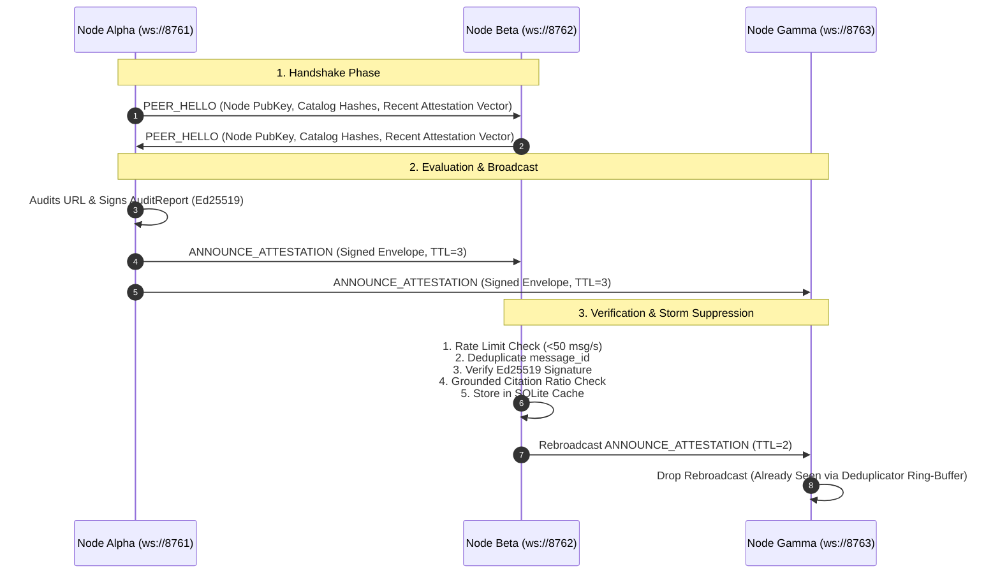

# Credence Mesh: P2P Gossip Protocol & Bayesian Consensus

The **Credence Mesh** ([`credence/mesh/`](file:///home/pendragon/Projects/credence/credence/mesh/)) is an asynchronous, decentralized peer-to-peer trust network that enables independent Credence nodes to exchange, verify, and aggregate Ed25519-signed audit attestations over WebSockets.

---

## 1. Why Decentralize Epistemic Auditing?

Centralized truth or fact-checking APIs have fundamental flaws:
1. **Single Points of Failure & Censorship**: Centralized nodes can be blocked, DDoS'd, or politically coerced.
2. **Duplicative Compute / Token Waste**: If Node A already spent tokens auditing a breaking news article, Node B should be able to verify Node A's cryptographic attestation and reuse the result in $0$ LLM tokens.
3. **Byzantine Fault Tolerance**: By gathering signed evaluations from multiple independent nodes and computing **Bayesian consensus**, the network eliminates rogue or compromised nodes.

---

## 2. P2P Gossip Protocol Specification



---

## 3. Envelope Data Structures (`protocol.py`)

Every message exchanged across the mesh is wrapped in a cryptographically signed envelope:

```python
class MeshMessageEnvelope(BaseModel):
    message_id: str = Field(default_factory=lambda: str(uuid.uuid4()))
    message_type: MeshMessageType  # PEER_HELLO, ANNOUNCE_ATTESTATION, REQUEST_ATTESTATION, etc.
    sender_pubkey: str            # Ed25519 Public Key Hex
    timestamp: datetime           # Transmission UTC Timestamp
    payload: Dict[str, Any]       # Typed Message Payload
    signature: Optional[str]      # Ed25519 signature over deterministic RFC 8785 JSON
```

---

## 4. Bayesian Consensus & Outlier Detection (`consensus.py`)

When multiple independent mesh nodes audit the same content SHA-256, the `BayesianConsensusAggregator` calculates a confidence-weighted consensus score:

$$\bar{S}_{\text{consensus}} = \frac{\sum_{i=1}^N S_i \times C_i \times R_i \times G_i}{\sum_{i=1}^N C_i \times R_i \times G_i}$$

Where:
- $S_i$: Evaluator suspicion score ($0.0 \dots 100.0$).
- $C_i$: Evaluator confidence ($0.0 \dots 1.0$).
- $R_i$: Node peer reputation weight ($1.0$ default).
- $G_i$: Grounded citation ratio ($\frac{\text{Grounded Citations}}{\text{Total Citations}}$).

### Byzantine Outlier Defense
If a rogue node attempts to whitewash a deceptive scam ($S_{\text{rogue}} = 0.0$) while honest nodes detect high deception ($S_1 = 65.0, S_2 = 70.0$), the consensus engine:
1. Detects that $|S_{\text{rogue}} - \bar{S}| > 25.0$ points.
2. Flags the rogue node's public key in `outlier_nodes`.
3. Strips the rogue vote from consensus calculations.

---

## 5. Local 3-Node Cluster Orchestration (`docker-compose.mesh.yml`)

The repository includes a ready-to-run 3-node P2P mesh cluster:

```bash
# Start 3-node cluster
just mesh-cluster-up

# View live peer gossip logs
just mesh-cluster-logs

# Stop cluster
just mesh-cluster-down
```
