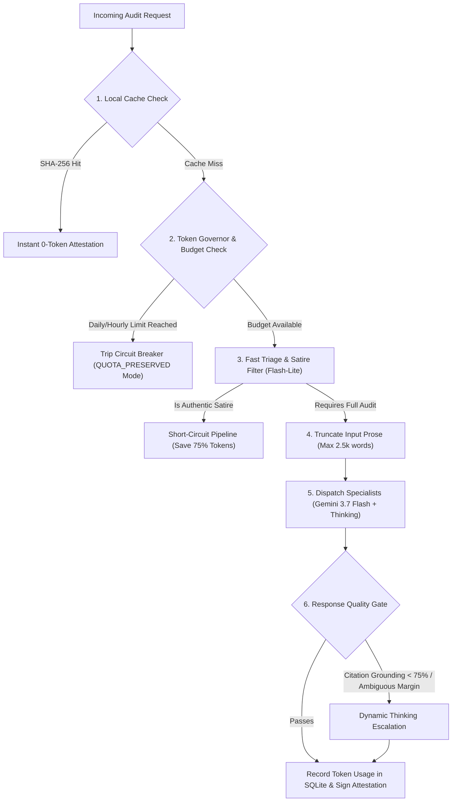

# Token Safety Governor, Response Quality Gates & Model Tiering

The **TokenBudgetGovernor** ([`credence/pipeline/governor.py`](file:///home/pendragon/Projects/credence/credence/pipeline/governor.py)) manages LLM token consumption, cost caps, and reasoning quality to ensure autonomous audits never exhaust shared API quotas or starve interactive Antigravity development sessions.

---

## 1. The Token Coexistence Challenge

When developing autonomous AI pipelines that make repeated LLM calls, sharing a single `GEMINI_API_KEY` across background workers and interactive developer pairing creates high operational risk:
- A large scraping run could consume all **TPM (Tokens Per Minute)** or **RPD (Requests Per Day)** quota.
- Interactive pairing with Antigravity encounters unexpected `429 ResourceExhausted` errors, grinding development to a halt.

---

## 2. 5-Layer Token Safety Architecture



---

## 3. Configuration Parameters (`.env`)

| Variable | Default | Description |
|---|---|---|
| `CREDENCE_GEMINI_API_KEY` | `None` | **Isolated API Key** (Prioritized over `GEMINI_API_KEY` to separate project quota). |
| `MAX_TOKENS_PER_HOUR` | `100,000` | Hourly safety ceiling. Reaching this triggers offline fallback. |
| `MAX_TOKENS_PER_DAY` | `1,000,000` | Rolling 24-hour token consumption cap. |
| `MAX_DAILY_BUDGET_USD` | `$0.50` | Maximum estimated USD spend allowed in a 24-hour window. |
| `ENABLE_CIRCUIT_BREAKER` | `True` | Automatically enables graceful offline heuristic fallback when limits are reached. |
| `DEFAULT_SPECIALIST_MODEL` | `gemini-3.7-flash` | Primary workhorse for specialist auditors. |
| `DEFAULT_THINKING_BUDGET` | `1024` | Thinking/reasoning tokens allocated for deep syllogistic dissection. |
| `ESCALATION_THINKING_BUDGET` | `4096` | High-thinking budget allocated for ambiguous or contested boundary scores. |

---

## 4. Model Pricing Matrix & Thinking Token Accounting

Reasoning models like **Gemini 3.7 Flash with Thinking** generate internal reasoning traces billed at completion token rates. The governor accounts for prompt, completion, and thinking tokens:

$$\text{Cost}_{\text{USD}} = \frac{T_{\text{prompt}}}{10^6} \times P_{\text{prompt}} + \frac{T_{\text{completion}}}{10^6} \times P_{\text{comp}} + \frac{T_{\text{thinking}}}{10^6} \times P_{\text{thinking}}$$

### Pricing Matrix (USD per 1,000,000 Tokens)

| Model | Prompt ($P_{\text{prompt}}$) | Completion ($P_{\text{comp}}$) | Thinking ($P_{\text{thinking}}$) |
|---|---|---|---|
| `gemini-3.7-flash` | **$0.15** | **$0.60** | **$0.60** |
| `gemini-2.5-flash-lite` | **$0.075** | **$0.30** | **$0.30** |
| `gemini-2.0-flash` | **$0.10** | **$0.40** | **$0.40** |
| `gemini-1.5-pro` | **$1.25** | **$5.00** | **$5.00** |

---

## 5. In-Database Tracking (`TokenUsageRecord`)

Every subagent API invocation is persisted to SQLite:

```python
class TokenUsageRecord(SQLModel, table=True):
    id: Optional[int] = Field(default=None, primary_key=True)
    timestamp: datetime = Field(default_factory=utc_now, index=True)
    model_name: str = Field(index=True)
    prompt_tokens: int = Field(default=0)
    completion_tokens: int = Field(default=0)
    thinking_tokens: int = Field(default=0)
    total_tokens: int = Field(default=0)
    estimated_cost_usd: float = Field(default=0.0)
    caller: str = Field(default="specialist", index=True)
    was_escalated: bool = Field(default=False)
```

---

## 6. Circuit Breaker Behavior

When rolling hourly or daily token limits are reached:
1. The governor trips into **`QUOTA_PRESERVED`** state.
2. The pipeline skips remote API calls and immediately routes through the **Offline Heuristic Rule Engine** ([`credence/pipeline/evaluator.py`](file:///home/pendragon/Projects/credence/credence/pipeline/evaluator.py)).
3. The resulting `AuditReport` is marked with `quota_preserved = True` and displays an advisory notice in the TUI/CLI.
4. As older calls roll past the 1-hour or 24-hour window, the circuit breaker automatically resets to `HEALTHY`.

---

## 7. Real-Time Headroom Monitoring

### CLI Command (`credence quota`)
```bash
poetry run credence quota
```

```
╭────────────────── Token Safety Governor & Headroom Budget ───────────────────╮
│ Active API Key Source: CREDENCE_GEMINI_API_KEY (Isolated Project)            │
│ Circuit Breaker Status: 🟢 HEALTHY (Normal Concurrency)                      │
│                                                                              │
│ Hourly Token Headroom: 88.4% remaining (11,600 / 100,000 tokens)             │
│ Daily Token Headroom:  96.2% remaining (38,000 / 1,000,000 tokens)           │
│ 24h Estimated Spend:    $0.0214 / $0.50 USD (4.3% budget used)               │
╰──────────────────────────────────────────────────────────────────────────────╯
```

### Textual TUI (`just tui`)
Press **`k`** or click on the **`⚡ Token Quota`** tab to inspect live token consumption and spend metrics.
